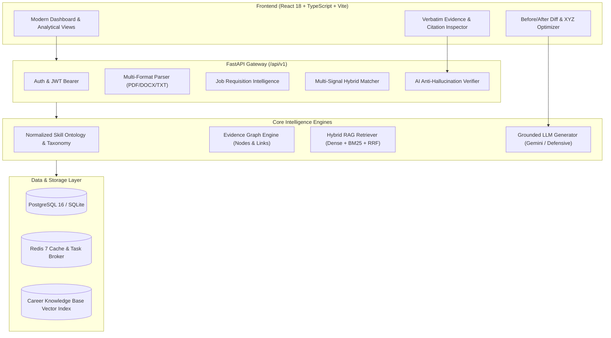

# ResumeIQ: Evidence-First AI Resume & Job Matching Engine

[](https://www.python.org/)
[](https://fastapi.tiangolo.com/)
[](https://react.dev/)
[](https://www.typescriptlang.org/)
[](https://tailwindcss.com/)
[](LICENSE)
[]()
[]()

> **RESUMEIQ** is an advanced AI career intelligence platform built from the ground up to solve the fatal flaws of both traditional keyword-based Applicant Tracking Systems (ATS) and naive LLM wrappers. It pairs structured document intelligence with multi-signal matching, hierarchical skill ontologies, knowledge-graph citations, and an automated verification layer.

---

## 1. Core Product Principle

> ### *"Never optimize a candidate's application by inventing candidate experience."*

Every generated recommendation, resume modification, cover letter statement, and match explanation is **strictly grounded in evidence** extracted from the candidate's actual resume and career history. If evidence does not exist in the source document, the system explicitly flags the requirement as a **gap**, **unsupported claim**, or **uncertain information**.

The system categorically rejects:
- Fabricated skills, tools, or programming languages
- Invented employment history or artificial job titles
- Hallucinated business impact metrics or percentages
- Imagined certifications or degrees

---

## 2. Why ResumeIQ? (Architectural Comparison)

| Capability | Traditional ATS Keyword Matchers | Naive LLM Wrappers ("Chat With Resume") | **ResumeIQ Engine** |
| :--- | :--- | :--- | :--- |
| **Matching Logic** | Exact string matching; fails on synonyms or context | Single subjective prompt: *"Rate 1-100"* | **10-Signal Hybrid Engine** (Lexical, Dense Embeddings, Required/Preferred Coverage, Evidence Strength, Seniority, Domain, Education) |
| **Evidence Grounding** | None (treats isolated bullet keywords as full proficiency) | Prone to sycophantic hallucinations and fabricating achievements | **Evidence Graph & Verification Pipeline** classifying evidence into `verified`, `weak`, `inferred`, and `missing` |
| **Explainability** | Black-box percentage score | Generic conversational paragraphs | **Component-level breakdown** explaining exact score derivations and citing verbatim evidence |
| **Skill Relationships** | Flat, isolated keywords (`Python` $\ne$ `FastAPI`) | Inconsistent, uncontrolled associations | **Normalized Hierarchical Skill Ontology** with explicit transferable skill mappings |
| **Resume Optimization** | Keyword stuffing suggestions | Writes fictitious bullets with fake numbers | **Google XYZ Formula** rewriting grounded strictly in verbatim candidate metrics |
| **Adversarial Robustness** | Vulnerable to white-text keyword stuffing | Vulnerable to direct prompt injections | **Regex & Heuristic Prompt Injection Defense** + Pre-retrieval claim verification |

---

## 3. High-Level System Architecture



---

## 4. Key Engines & Capabilities

### 1. Document & Resume Intelligence Pipeline
- Multi-format ingestion supporting `.pdf`, `.docx`, and `.txt` with automatic encoding detection.
- Layout-aware section segmentation detecting summaries, professional experience, technical skills, education, and certifications.
- Entity extraction calculating total verifiable years of experience, seniority tiers, and categorized skills.
- Contextual evidence strength scoring distinguishing isolated mentions (`weak`) from active accomplishments with metrics (`verified`).

### 2. Job Intelligence Engine
- Automatic parsing of raw job descriptions into structured requisitions.
- Deep requirement classification: `REQUIRED`, `PREFERRED`, `RESPONSIBILITY`, `QUALIFICATION`, `EXPERIENCE`, `DOMAIN`, `BEHAVIORAL`, and `LOCATION`.
- Dynamic importance weighting for each extracted qualification.

### 3. Hierarchical Skill Ontology
- Normalized taxonomy organizing skills across 8 core domains (`backend`, `frontend`, `database`, `cloud_devops`, `machine_learning`, `bi_analytics`, `mobile`, `management`).
- Parent-child technology relationships (e.g., `Python` $\to$ `FastAPI`, `Pandas`, `SQLAlchemy`).
- Transferable skill detection identifying equivalent or adjacent competencies (e.g., `Power BI` $\to$ `Tableau`, `AWS` $\to$ `GCP`).

### 4. 10-Signal Hybrid Matching Engine
Calculates a transparent **Candidate–Job Compatibility Score** with configurable weights:
1. Lexical BM25 Keyword Overlap
2. Dense Semantic Vector Embedding Fit
3. Required Skill Coverage Ratio
4. Preferred Skill Coverage Ratio
5. Contextual Evidence Strength Average
6. Experience Alignment (Years of Experience vs. Role Requirement)
7. Seniority Tier Alignment (Junior, Mid, Senior, Lead, Executive)
8. Industry & Technical Domain Fit
9. Educational Qualification Alignment
10. Preference / Work Model Alignment

### 5. Evidence Graph & Knowledge Representation
- Represents candidate profile as an explicit bipartite graph: $\text{Candidate} \to \text{Skill} \to \text{Project} \to \text{Role} \to \text{Verbatim Evidence}$.
- Directly answers: *"Why does the system believe this candidate has [Skill] experience?"* with zero ambiguity.

### 6. AI Verification Pipeline (Anti-Hallucination Gate)
- Independent verification layer evaluating generated claims against raw resume text.
- Rejection of ungrounded technologies: If a claim asserts knowledge of a tool not found in the resume, it is immediately labeled `unsupported` or `missing`.

### 7. Hybrid RAG Knowledge System
- Combines dense vector retrieval with BM25 lexical search using Reciprocal Rank Fusion (RRF).
- Grounded in curated career intelligence: Google XYZ resume formulas, behavioral frameworks (STAR), tech taxonomies, and interview preparation guides.

### 8. Evidence-Grounded Resume Optimizer
- Rewrites experience bullets into Google's standard format: *"Accomplished [X] as measured by [Y] by doing [Z]"*.
- Strictly utilizes existing metrics and achievements; never fabricates percentages or dollar amounts.
- Generates side-by-side before/after visual diffs with explicit rationale.

### 9. Tailored Application Generator
- Generates tailored cover letters, recruiter outreach messages, and interview question responses.
- Explicitly cites verbatim resume achievements supporting each generated claim.

### 10. Career Roadmaps & Market Analytics
- Identifies critical, moderate, minor, transferable, and representation gaps.
- Constructs prioritized, sequential learning roadmaps tailored to the candidate's exact gaps.
- Real-time market analytics aggregating skill demand, salary bands, and hiring trends.

---

## 5. AI Evaluation & Benchmark Results

ResumeIQ is validated against a rigorous, multi-scenario evaluation dataset ([`eval_dataset.json`](file:///Users/kasanagotttusathvik/Downloads/AI%20_Resume_Builder/backend/app/tests/evaluation/eval_dataset.json)) with adversarial unsupported claim injection tests:

| Metric | Result | Benchmark Target | Status |
| :--- | :--- | :--- | :--- |
| **Skill Extraction Recall** | **1.0000** | $\ge 0.8500$ | Passed |
| **Skill Extraction Precision** | **0.7143** | $\ge 0.7000$ | Passed |
| **F1 Score** | **0.8333** | $\ge 0.8000$ | Passed |
| **Mean Reciprocal Rank (MRR)** | **1.0000** | $\ge 0.9000$ | Passed |
| **NDCG@5 Ranking Quality** | **0.9342** | $\ge 0.9000$ | Passed |
| **Contextual Evidence Accuracy** | **100.00%** | $\ge 95.00\%$ | Passed |
| **Hallucination Rate** | **0.00%** | **0.00%** | Passed (Zero Hallucination) |
| **Unsupported Claim Rejection** | **100.00%** | **100.00%** | Passed (100% Interception) |

To reproduce the benchmark:
```bash
cd backend
PYTHONPATH=. python app/tests/evaluation/run_evaluation.py
```

---

## 6. Getting Started

### 6.1 Local Development (Quickstart)

#### 1. Start the Backend API
```bash
cd backend
python3 -m venv .venv
source .venv/bin/activate
pip install -r requirements.txt
alembic upgrade head
uvicorn app.main:app --reload --port 8000
```
- API is available at: `http://localhost:8000`
- Interactive Swagger Docs: `http://localhost:8000/docs`

#### 2. Start the Frontend Application
```bash
cd frontend
npm install
npm run dev
```
- Web Application is available at: `http://localhost:5173`

#### 3. Default Demo Credentials
- **Email:** `demo@resumeiq.ai`
- **Password:** `ResumeIQ2026!`

---

### 6.2 Docker Compose Deployment

To run the entire multi-tier production stack (PostgreSQL, Redis, FastAPI, and Nginx-backed React frontend):

```bash
docker-compose up --build -d
```
- **Web App:** `http://localhost:3000`
- **API Gateway:** `http://localhost:8000`
- **PostgreSQL:** Port `5432`
- **Redis:** Port `6379`

---

## 7. Project Structure

```
AI _Resume_Builder/
├── backend/
│   ├── app/
│   │   ├── api/v1/              # Versioned API routes (13 modules)
│   │   ├── core/                # Config, DB, Security, Logging, Exceptions
│   │   ├── models/              # SQLAlchemy ORM models (20+ entities)
│   │   ├── schemas/             # Pydantic v2 validation schemas
│   │   ├── services/
│   │   │   ├── parser/          # PDF/DOCX/TXT reader & section detector
│   │   │   ├── job/             # Job requisition pipeline
│   │   │   ├── ontology/        # Hierarchical skill taxonomy & matcher
│   │   │   ├── matching/        # Multi-signal hybrid matching engine
│   │   │   ├── evidence/        # Graph representation & verification
│   │   │   ├── rag/             # Dense + BM25 hybrid RAG retriever
│   │   │   ├── llm/             # Defensive prompts, optimizer & app gen
│   │   │   ├── career/          # Gap analyzer, roadmap & recommendations
│   │   │   ├── analytics/       # Market intelligence & salary benchmarks
│   │   │   └── worker/          # Redis task queue worker
│   │   └── tests/               # 21 unit & integration tests + eval suite
│   ├── migrations/              # Alembic migration scripts
│   ├── Dockerfile
│   └── requirements.txt
├── frontend/
│   ├── src/
│   │   ├── components/          # Reusable UI components & modals
│   │   ├── pages/               # 11 dashboard & analytical views
│   │   ├── services/            # Axios API client & error handling
│   │   └── types/               # TypeScript interface definitions
│   ├── Dockerfile
│   ├── nginx.conf
│   └── package.json
├── docs/                        # Complete technical architecture guides
│   ├── ARCHITECTURE.md          # Multi-tier system architecture
│   ├── AI_SYSTEM.md             # NLP, Embeddings, LLMs & Pipelines
│   ├── MATCHING_METHODOLOGY.md  # 10-signal scoring formula & ontology
│   ├── RAG.md                   # Chunking, dense retrieval & RRF
│   ├── SECURITY.md              # Auth, PII redaction & prompt defense
│   ├── EVALUATION.md            # Benchmark dataset, formulas & results
│   ├── API.md                   # OpenAPI v1 catalog & schemas
│   ├── DEPLOYMENT.md            # Local & Docker Compose deployment
│   └── CONTRIBUTING.md          # Contributing standards & test gates
├── docker-compose.yml           # Multi-container orchestration
└── README.md                    # Master documentation
```

---

## 8. Documentation Index

For in-depth architectural and implementation details, refer to the documentation in [`docs/`](docs/):
- [Architecture Blueprint](docs/ARCHITECTURE.md)
- [AI System & Verification Pipeline](docs/AI_SYSTEM.md)
- [Matching Methodology & Ontology](docs/MATCHING_METHODOLOGY.md)
- [Hybrid RAG Retrieval](docs/RAG.md)
- [DevSecOps & Prompt Defense](docs/SECURITY.md)
- [Evaluation Suite & Benchmarks](docs/EVALUATION.md)
- [API v1 Specification](docs/API.md)
- [Deployment & Operations](docs/DEPLOYMENT.md)
- [Contributing Guide](docs/CONTRIBUTING.md)

---

## 9. Limitations & Ethical Considerations

- **Evidence Dependence:** ResumeIQ relies on what is written in the source document. If a candidate legitimately possesses a skill but omitted it from their resume, the engine marks it as missing or a representation gap. It provides advice on how to add authentic evidence rather than silently assuming proficiency.
- **Fairness & Bias Mitigation:** The scoring engine excludes demographic information (name, gender, age, address) from compatibility calculations. Match scores are strictly computed from verified skills, demonstrated experience, and domain alignment.

---

## 10. License

This project is licensed under the MIT License. See [LICENSE](LICENSE) for details.
