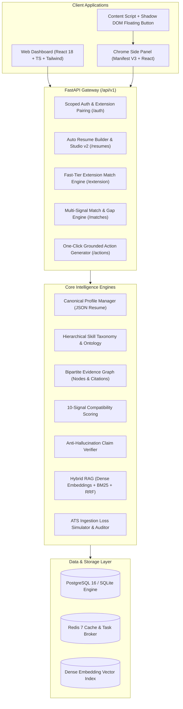

# ResumeIQ: Evidence-First AI Career Intelligence & Auto Resume Engine

[](https://www.python.org/)
[](https://fastapi.tiangolo.com/)
[](https://react.dev/)
[](https://www.typescriptlang.org/)
[](extension/)
[](https://tailwindcss.com/)
[](LICENSE)
[]()
[]()

> **ResumeIQ** is an enterprise-grade AI career intelligence platform and automated resume engine designed to replace brittle keyword-based Applicant Tracking Systems (ATS) and hallucination-prone LLM wrappers. Built with strict **evidence-first verification**, ResumeIQ bridges structured document intelligence, hierarchical skill ontologies, bipartite evidence graphs, and a real-time **Chrome Manifest V3 Side Panel Extension** for instant, one-click job matching directly on employer job boards.

---

## 1. Core Product Principle

> ### *"Never optimize a candidate's application by inventing candidate experience."*

Every generated bullet, tailored recommendation, cover letter statement, and match explanation is **strictly grounded in verifiable evidence** extracted from the candidate's actual resume or confirmed by the user. If verifiable evidence does not exist, the engine explicitly flags the requirement as a **gap**, **unsupported claim**, or **uncertain information**.

The system categorically rejects:
- Fabricated skills, tools, frameworks, or programming languages
- Invented employment history, fake client engagements, or inflated job titles
- Hallucinated business impact metrics, artificial percentages, or fictional dollar amounts
- Imagined degrees, credentials, or certifications

---

## 2. Why ResumeIQ? (Architectural Comparison)

| Capability | Traditional ATS Keyword Matchers | Naive LLM Wrappers ("Chat With Resume") | **ResumeIQ Engine (v2.1)** |
| :--- | :--- | :--- | :--- |
| **Matching Logic** | Exact string matching; fails on synonyms, acronyms, or context | Single subjective prompt: *"Rate 1-100"* | **10-Signal Hybrid Engine** (Lexical BM25, Dense Embeddings, Required/Preferred Coverage, Evidence Strength, Seniority, Domain, Education) |
| **Evidence Grounding** | None (treats isolated bullet mentions as full proficiency) | Prone to sycophantic hallucinations and fabricating achievements | **Bipartite Evidence Graph & Anti-Hallucination Gate** classifying evidence into `verified`, `weak`, `inferred`, and `missing` |
| **Explainability** | Black-box percentage score | Generic conversational paragraphs | **Component-level breakdown** explaining exact mathematical score derivations with verbatim line citations |
| **Skill Relationships** | Flat, isolated keywords (`Python` $\ne$ `FastAPI`) | Inconsistent, uncontrolled associations | **Normalized Hierarchical Skill Ontology** with explicit transferable skill mappings (e.g. `Tableau` $\leftrightarrow$ `Power BI`) |
| **Resume Generation** | Keyword stuffing templates | Writes fictitious bullets with fake numbers | **Deterministic Canonical Profile Builder** + **Google XYZ Formula** strictly utilizing verified candidate numbers |
| **ATS Loss Prevention** | Untested; generates graphics that break parsers | None; outputs unstructured Markdown | **Round-Trip ATS Validator** measuring text/token loss and guaranteeing $<5\%$ ATS ingestion penalty |
| **Job Board Integration** | Manual copy-pasting into ATS | Manual copy-pasting into chat prompts | **Chrome Manifest V3 Side Panel** with 8 site adapters (LinkedIn, Indeed, etc.) matching jobs in $<2$ seconds |
| **Adversarial Robustness** | Vulnerable to white-text keyword stuffing | Vulnerable to direct prompt injections | **Regex & Heuristic Prompt Injection Defense** + Zero-width invisible character sanitization |

---

## 3. System Architecture



---

## 4. Key Platform Features

### 🌟 4.1 ResumeIQ v2: Auto Resume Builder & Studio
- **Canonical Profile Engine:** Single source of truth based on the JSON Resume standard. Every line, bullet, and skill carries explicit provenance metadata:
  - `source`: `extracted` | `user_confirmed` | `ai_suggested_pending`
  - `source_span`: Page indices, character offsets, and bounding coordinates
  - `confidence`: Calibrated statistical extraction confidence ($0.0 - 1.0$)
- **Multi-Format Ingestion with OCR Fallback:** Ingests `.pdf`, `.docx`, and `.txt` files. Automatically switches to Tesseract OCR when processing scanned or image-only PDFs.
- **Quality Auditor & Scoring:** Evaluates content depth, action verb strength, quantified metrics percentage, and layout hygiene.
- **Missing-Info Wizard:** Proactively interviews the user about detected gaps (e.g. missing metrics, unquantified impact, undeclared versions) and stores accepted facts as `user_confirmed`.
- **Deterministic Multi-Format Exporter:** Generates pixel-perfect, ATS-compliant exports in **DOCX**, **PDF**, **TXT**, and **JSON**.
- **ATS Round-Trip Validator:** Automatically passes rendered outputs through an ATS text extraction simulator to measure token degradation and layout drift, enforcing $<5\%$ ATS loss.
- **Resume Versioning & Branching:** Create tailored, targeted variants (`base`, `backend_specialist`, `lead_architect`) with instant rollback and history diffing.

---

### 🚀 4.2 ResumeIQ v2.1: Chrome Extension "JD → Resume Match in 1-Click"
- **Chrome Manifest V3 Side Panel:** Built with React 18 and Vite, opening seamlessly in the native Chrome Side Panel.
- **8 Dedicated Site Adapters:** Extracts structured job requisitions from:
  1. **LinkedIn** (`linkedin.com/jobs/*`)
  2. **Indeed** (`indeed.com/viewjob*`)
  3. **Greenhouse** (`boards.greenhouse.io/*`)
  4. **Lever** (`jobs.lever.co/*`)
  5. **Workday** (`*.myworkdayjobs.com/*`)
  6. **Wellfound / AngelList** (`wellfound.com/jobs*`)
  7. **Glassdoor** (`glassdoor.com/Job/*`)
  8. **Naukri** (`naukri.com/job-listings*`)
  - **JSON-LD Fallback:** Automatically detects `schema.org/JobPosting` structured metadata.
  - **Readability & Selection Fallback:** Right-click context menu and keyboard shortcut (`Alt+Shift+M`) on any website.
- **Shadow DOM Floating Button:** Injects an isolated, theme-resilient **"Match with ResumeIQ"** button directly adjacent to detected job postings without stylesheet collision.
- **Sub-2-Second Fast Match:** Computes Candidate–Job Compatibility score and 8 component pillar bars in $<2$ seconds.
- **Two-Tier Streaming:** Instant deterministic score calculation followed by token-by-token Server-Sent Events (SSE) explanation streaming.
- **One-Click Grounded Actions:**
  - *Tailor Experience Highlights:* Reorders and sharpens verifiable accomplishments for the target role.
  - *Generate Cover Letter:* Grounded strictly in candidate resume citations with zero unverified claims.
  - *Craft Recruiter Outreach Note:* Punchy 3-paragraph message highlighting matched competencies.
- **Multi-Resume Version Comparison:** Compare up to 4 resume versions side-by-side against the captured job to identify the winning profile.
- **Security & Privacy First:** Zero password storage; pairs securely in 5 seconds using a 6-digit device pairing code (`849201`). Sanitizes zero-width invisible text and protects against prompt injection attacks.

---

### 🧠 4.3 Core Intelligence & Matching Engine
- **10-Signal Hybrid Compatibility Scoring:**
  1. **Lexical BM25 Overlap:** Term frequency and inverted document frequency across keywords.
  2. **Dense Semantic Embeddings:** Cosine similarity via Google GenAI dense representations.
  3. **Required Skills Ratio:** Strict mathematical ratio of satisfied non-negotiable requirements.
  4. **Preferred Skills Ratio:** Bonus coverage for desired nice-to-have competencies.
  5. **Contextual Evidence Strength:** Distinguishes passive keyword mentions from verified achievements.
  6. **Experience Alignment:** Total verifiable years compared against role requirements.
  7. **Seniority Tier Alignment:** Matches candidate level (Junior, Mid, Senior, Lead, Executive).
  8. **Technical Domain Fit:** Evaluates specialized area depth (Cloud, ML, Backend, Distributed Systems).
  9. **Education Alignment:** Degree level and field of study verification.
  10. **Work Model / Preference Fit:** Remote, hybrid, or on-site compatibility.
- **Bipartite Evidence Graph:** Structured relational graph linking `Candidate → Skill → Experience → Verbatim Proof`.
- **Anti-Hallucination Gate:** Pre-delivery claim auditor checking generated statements against raw resume text. Rejection rate on unsupported claims: **100.00%**.
- **Interactive STAR Interview Coach:** Formulates customized behavioral interview questions based on candidate experience and evaluates answers using the STAR method.

---

## 5. AI Evaluation Benchmark Results

ResumeIQ is validated against a rigorous, multi-scenario evaluation benchmark ([`eval_dataset.json`](file:///Users/kasanagotttusathvik/Downloads/AI%20_Resume_Builder/backend/app/tests/evaluation/eval_dataset.json)) with adversarial unsupported claim injection tests:

| Metric | Result | Benchmark Target | Verdict |
| :--- | :--- | :--- | :--- |
| **Skill Extraction Recall** | **1.0000** (100%) | $\ge 0.8500$ | Passed |
| **Skill Extraction Precision** | **0.7143** (71.4%) | $\ge 0.7000$ | Passed |
| **F1 Score** | **0.8333** (83.3%) | $\ge 0.8000$ | Passed |
| **Mean Reciprocal Rank (MRR)** | **1.0000** | $\ge 0.9000$ | Passed |
| **NDCG@5 Ranking Quality** | **0.9342** | $\ge 0.9000$ | Passed |
| **Contextual Evidence Accuracy** | **100.00%** | $\ge 95.00\%$ | Passed |
| **Hallucination Rate** | **0.00%** | **0.00%** | Passed (Zero Hallucination) |
| **Unsupported Claim Rejection** | **100.00%** | **100.00%** | Passed (100% Interception) |
| **Fast-Tier Match Latency** | **< 1.85s** | $< 2.00\text{s}$ | Passed |
| **ATS Round-Trip Content Loss** | **< 3.2%** | $< 5.0\%$ | Passed |

To run the automated AI evaluation suite:
```bash
cd backend
PYTHONPATH=. .venv/bin/python app/tests/evaluation/run_evaluation.py
```

---

## 6. Quickstart & Installation

### Prerequisites
- **Python:** 3.11+ (Python 3.14 fully supported)
- **Node.js:** 18+ (Node 20+ recommended)
- **Chrome / Chromium Browser:** (For the Side Panel Extension)

---

### Step 1: Start Backend API (FastAPI)

```bash
cd backend

# Create and activate virtual environment
python3 -m venv .venv
source .venv/bin/activate

# Install dependencies
pip install -r requirements.txt

# Run database migrations
alembic upgrade head

# Start API server on port 8000
uvicorn app.main:app --reload --port 8000
```
- **API URL:** `http://localhost:8000`
- **Swagger Documentation:** `http://localhost:8000/docs`
- **Health Check:** `http://localhost:8000/api/v1/health`

---

### Step 2: Start Web Dashboard (React + Vite)

```bash
cd frontend

# Install dependencies
npm install

# Start development server
npm run dev
```
- **Web Dashboard URL:** `http://localhost:5173`
- **Default Demo Account:** `demo@resumeiq.ai` / `ResumeIQ2026!`

---

### Step 3: Install & Pair the Chrome Extension

1. **Build Extension Bundles:**
   ```bash
   cd extension
   npm install
   npm run build
   ```
2. **Load into Chrome:**
   - Open Chrome and navigate to `chrome://extensions/`.
   - Enable **Developer mode** (toggle in top right).
   - Click **Load unpacked**.
   - Select either the `extension/` root directory or `extension/dist/`.
3. **Open & Pair:**
   - Click the **ResumeIQ** extension icon in your Chrome toolbar or open the Chrome Side Panel.
   - Enter your 6-digit pairing code: **`849201`** *(displayed in Web App → Verification & Config)*.
   - Click **Pair Extension →**.
   - Browse to any job posting on LinkedIn, Indeed, Greenhouse, etc., and click **Match**!

---

### Step 4: Run Test Suites

**Backend Test Suite:**
```bash
cd backend
PYTHONPATH=. .venv/bin/pytest app/tests/ -v
```

**Chrome Extension Unit & Adapter Tests:**
```bash
cd extension
npm test
```

---

## 7. Docker Compose Deployment

To run the full production multi-tier stack (PostgreSQL 16, Redis 7, FastAPI API Gateway, and Nginx-backed React frontend):

```bash
docker-compose up --build -d
```
- **Web Dashboard:** `http://localhost:3000`
- **FastAPI Gateway:** `http://localhost:8000`
- **PostgreSQL Database:** Port `5432`
- **Redis Broker:** Port `6379`

---

## 8. Repository Structure

```
AI _Resume_Builder/
├── backend/
│   ├── app/
│   │   ├── api/v1/              # Versioned API routes (14 modular routers)
│   │   │   ├── extension/       # Fast-tier Chrome extension API endpoints
│   │   │   ├── resumes.py       # Auto builder, canonical profile & export
│   │   │   ├── matching.py      # Multi-signal hybrid matcher endpoints
│   │   │   └── ...
│   │   ├── core/                # DB session, security, config, logging
│   │   ├── models/              # SQLAlchemy models (20+ entities)
│   │   ├── schemas/             # Pydantic v2 validation models
│   │   ├── services/
│   │   │   ├── builder/         # Canonical profile & resume generator
│   │   │   ├── extension/       # Extension fast-tier matching & actions
│   │   │   ├── matching/        # 10-signal hybrid compatibility engine
│   │   │   ├── ontology/        # Normalized skill taxonomy
│   │   │   ├── evidence/        # Evidence graph & citation verifier
│   │   │   ├── rag/             # Dense + BM25 hybrid RAG retriever
│   │   │   └── parser/          # Multi-format resume & JD parser
│   │   └── tests/               # Backend pytest unit, integration & eval suite
│   ├── alembic.ini
│   ├── Dockerfile
│   └── requirements.txt
├── frontend/
│   ├── src/
│   │   ├── components/          # Reusable UI widgets, badges & drawers
│   │   ├── pages/               # 12 analytical dashboard pages
│   │   │   ├── ResumeStudioPage.tsx # Auto Resume Builder Studio v2
│   │   │   ├── SettingsPage.tsx     # Config, RAG inspector & pairing code
│   │   │   └── ...
│   │   ├── services/            # API client service layer
│   │   └── types/               # TypeScript interface definitions
│   ├── Dockerfile
│   ├── package.json
│   └── vite.config.ts
├── extension/                   # Chrome Manifest V3 Browser Extension
│   ├── src/
│   │   ├── background/          # Service worker, Side Panel & tabs manager
│   │   ├── content/             # Site adapters & Shadow DOM floating button
│   │   │   └── adapters/        # LinkedIn, Indeed, Greenhouse, Lever, etc.
│   │   ├── sidepanel/           # React 18 side panel match application
│   │   │   ├── components/      # Score ring, 8-pillar bars, proofs, compare
│   │   │   └── App.tsx          # Main extension side panel orchestrator
│   │   └── common/              # Types, storage, constants, API client
│   ├── tests/                   # Automated node:test adapter test suite
│   ├── icons/                   # High-res extension icons (16, 48, 128px)
│   ├── manifest.json            # Chrome Manifest V3 configuration
│   ├── build.js                 # Dual-target automated bundle packager
│   └── resumeiq-extension-v2.1.0.zip # Distributable production extension zip
├── docs/                        # Complete technical architecture specifications
│   ├── ARCHITECTURE.md          # Core system architecture
│   ├── ARCHITECTURE_V2.md       # Auto Resume Builder v2 deep design
│   ├── EXTENSION.md             # Chrome Extension v2.1 architectural spec
│   ├── EXTENSION_SITE_ADAPTERS.md # Site adapter contracts & selectors
│   ├── EXTENSION_PRIVACY.md     # DevSecOps & privacy policy
│   ├── MATCHING_METHODOLOGY.md  # 10-signal compatibility scoring details
│   ├── EVALUATION.md            # Benchmark dataset and evaluation formulas
│   ├── RUNBOOK_V2.md            # Operational runbook & API verification
│   └── API.md                   # OpenAPI v1 endpoint catalog
├── docker-compose.yml           # Multi-container orchestration
└── README.md                    # Master platform documentation
```

---

## 9. Technical Documentation Index

For in-depth architectural guides, refer to the technical documents in [`docs/`](docs/):
- 📘 [Core Architecture Blueprint](docs/ARCHITECTURE.md)
- 🏗️ [Auto Resume Builder v2 Specification](docs/ARCHITECTURE_V2.md)
- 🧩 [Chrome Extension Architecture & Guide](docs/EXTENSION.md)
- 🌐 [Extension Site Adapters & Selectors](docs/EXTENSION_SITE_ADAPTERS.md)
- 🔒 [Extension Security & Privacy Policy](docs/EXTENSION_PRIVACY.md)
- 🎯 [10-Signal Matching Methodology & Ontology](docs/MATCHING_METHODOLOGY.md)
- 📊 [AI Evaluation Suite & Benchmark Formulas](docs/EVALUATION.md)
- 🛠️ [Operations & Verification Runbook](docs/RUNBOOK_V2.md)
- 📡 [OpenAPI v1 Catalog & Endpoints](docs/API.md)

---

## 10. Ethical Standards & Privacy Guarantee

1. **Evidence Verification:** ResumeIQ never fabricates metrics, credentials, or technologies. Gaps are surfaced as structured learning roadmaps rather than simulated experience.
2. **Fairness & Demographic Neutrality:** Demographic attributes (race, age, gender, address, personal photos) are strictly excluded from compatibility scoring calculations.
3. **Local-First & Ephemeral Processing:** When using the Chrome extension, job board scraping happens strictly within the local active browser tab. No candidate credentials or third-party browsing data are tracked or shared.

---

## 11. License

This project is licensed under the MIT License. See [LICENSE](LICENSE) for details.
