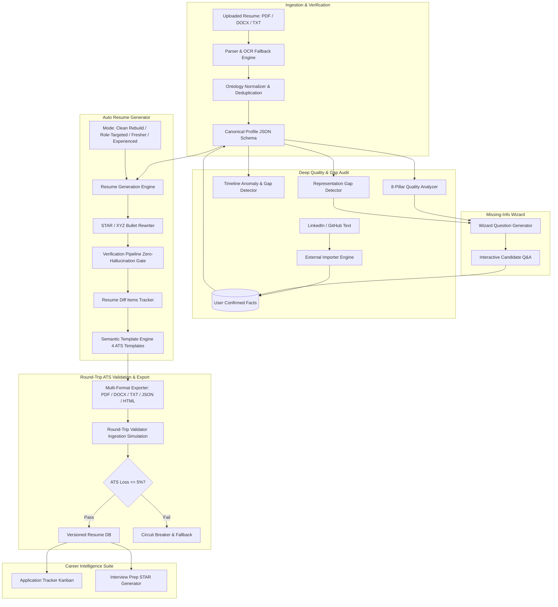
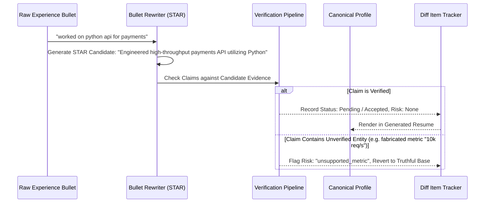

# RESUMEIQ v2: Architecture Specification
## Auto Resume Builder & Deep Career Intelligence Platform

---

### Executive Summary

**RESUMEIQ v2** upgrades the evidence-first career platform from a matching engine into an end-to-end **Autonomous Resume Builder and Career Intelligence Studio**. At its foundation lies the unbreakable core principle:

> **"Never optimize a candidate's application by inventing candidate experience."**
>
> Every generated line, rewritten bullet, summary statement, and interview talking point must strictly trace to verified evidence extracted from the candidate's uploaded resume or explicitly confirmed by the candidate in the application.

---

### 1. High-Level System Architecture

---

### 2. Canonical Profile Schema & Lineage Tracking

The **Canonical Profile** (`app/schemas/canonical_profile.py`) serves as the single source of truth for all downstream resume representations. Resumes are **never edited as arbitrary text**, but always generated deterministically from this verified model.

#### Field-Level Evidence Metadata

Every atomic field (summary, bullet, skill, degree, certification) is wrapped in metadata carrying:
- `source`: `'extracted'` | `'user_confirmed'` | `'ai_suggested_pending'`
- `source_span`: Page number and character boundary offsets in original document
- `confidence`: Calibrated confidence score (0.0 to 1.0)
- `is_verified`: Boolean validation state

#### Renderable & Redacted Projections

1. **`get_renderable_copy()`**:
   - Strictly strips all fields marked as `'ai_suggested_pending'`.
   - Only fields with `'extracted'` or `'user_confirmed'` are projected into the rendered document.
   - Prevents unreviewed AI suggestions from leaking into final resumes.

2. **`get_redacted_copy()` (Blind Screening Mode)**:
   - Sanitizes Personally Identifiable Information (PII) to eliminate unconscious bias in hiring screens:
     - Name replaced with `"[REDACTED CANDIDATE]"`
     - Email replaced with `"[REDACTED EMAIL]"`
     - Phone replaced with `"[REDACTED PHONE]"`
     - Location replaced with `"[REDACTED LOCATION]"`
     - External hyperlinks stripped of candidate handles

---

### 3. Generation Engine & Zero-Hallucination Verification

The generation engine (`app/services/builder/generation_engine.py`) provides 4 operational modes:
1. **Clean Rebuild**: Upgrades typography, layout, and phrasing while strictly preserving exact scope.
2. **Role-Targeted**: Aligns section order and highlights truthful overlaps matching a target job description.
3. **Fresher / Student**: Prioritizes education, academic coursework, verified projects, and hackathons.
4. **Experienced**: Elevates leadership achievements, production scale, and metric-dense bullet points.

#### STAR / XYZ Bullet Rewriting (`app/services/builder/bullet_rewriter.py`)

Transforms passive, weak descriptions into dynamic STAR/XYZ bullets:
- Replaces weak action verbs (e.g., `"worked on"`, `"helped with"`) with strong industry verbs (e.g., `"Engineered"`, `"Architected"`, `"Optimized"`).
- Front-loads quantitative impact and outcomes.
- **Strict Verification Gate**: Blocks injection of any technology, tool, metric number, employer name, or credential not proven by existing evidence or user-confirmed facts.

---

### 4. ATS-Safe Templates & Round-Trip Validation

The template engine (`app/services/builder/template_engine.py`) enforces strict Applicant Tracking System (ATS) compatibility guidelines:
- **Single-Column Semantic Layout**: Avoids multi-column tables, text frames, or complex floats that scramble text ordering in older ATS parsers.
- **Pure Text Hierarchies**: Standard headings (`<h2>`, `<h3>`), standard bullet lists (`<ul>`, `<li>`), zero rasterized text images.
- **Selectable Vector PDF**: Custom PDF 1.4 xref engine generating standard Helvetica streams that render with 100% extractable character integrity.

#### Round-Trip Simulation Pipeline (`app/services/builder/roundtrip_validator.py`)

To ensure ATS safety before publishing:
1. Renders canonical profile into HTML/PDF/DOCX.
2. Feeds the generated artifact into the document parser (`ResumeParser`).
3. Re-extracts candidate entities (skills, experience, titles, metrics).
4. Computes the **`ats_loss_score`**:
   $$\text{ATS Loss} = 1.0 - \left(0.5 \cdot \text{Skill Retention} + 0.3 \cdot \text{Experience Retention} + 0.2 \cdot \text{Token Jaccard}\right)$$
5. **Quality Gate**: Enforces $\text{ATS Loss} \le 0.05$ (at least 95% fidelity). If loss exceeds 5%, the system reverts to the minimal plain layout.

---

### 5. Quality & Deep Intelligence Suite

#### 8-Pillar Quality Scoring Engine (`app/services/quality/quality_analyzer.py`)

Evaluates resumes across 8 weighted dimensions:
| Pillar | Weight | Focus Area |
| :--- | :---: | :--- |
| **Structure & Layout** | 15% | Standard section hierarchy, contact completeness |
| **Clarity & Conciseness** | 15% | Sentence brevity, elimination of fluff and buzzwords |
| **Impact Language** | 15% | Active voice frequency, strong action verbs |
| **Evidence Density** | 15% | Quantified metrics, substantiated achievements |
| **Keyword Truthfulness** | 15% | Legitimate industry terminology without keyword stuffing |
| **Consistency** | 10% | Date formatting uniformity, verb tense alignment |
| **Length Appropriateness** | 10% | Page count alignment with career seniority |
| **ATS Readability** | 5% | Machine readability and character set purity |

#### Timeline Anomaly Engine (`app/services/quality/timeline_engine.py`)
Detects chronological inconsistencies:
- Overlapping full-time roles without concurrent designations.
- Unexplained employment gaps (> 6 months).
- Impossible dates (end date preceding start date).
- Provides remediation hints for the Missing-Info Wizard.

#### Representation Gap Engine (`app/services/quality/representation_gaps.py`)
Identifies technologies and capabilities mentioned in bullet contexts (e.g. *"deployed containerized service with Docker"*) that were accidentally omitted from the candidate's skills list, allowing one-click addition via verified evidence.

---

### 6. Missing-Info Wizard & External Importers

- **Missing-Info Wizard (`app/services/wizard/wizard_service.py`)**:
  - Dynamically synthesizes targeted clarifying questions based on detected quality gaps.
  - Candidate answers are persisted as `UserConfirmedFact` records with explicit timestamps and confidence ratings.
- **External Importers (`app/services/quality/external_importer.py`)**:
  - Ingests raw exported profile text from LinkedIn and repository READMEs from GitHub.
  - Normalizes and verifies imported facts against standard tech ontologies.

---

### 7. Application Tracker & Interview Prep STAR Engine

- **Application Tracker (`app/api/v1/builder.py`)**:
  - Full-lifecycle tracking across 5 pipeline stages (`saved`, `applied`, `interviewing`, `offer`, `rejected`).
  - Directly links each application to the specific Resume Version utilized.
- **Interview Prep STAR Engine (`app/services/career/interview_prep_service.py`)**:
  - Automatically synthesizes behavioral, technical architecture, and impact questions grounded in the candidate's verified resume bullet points.
  - Generates comprehensive STAR skeletons:
    - **[S] Situation**: Real project context
    - **[T] Task**: Core objective
    - **[A] Action**: Technical steps taken
    - **[R] Result**: Verified quantitative or qualitative impact
    - **Architecture & Trade-offs**: System design considerations for senior engineering roles.
